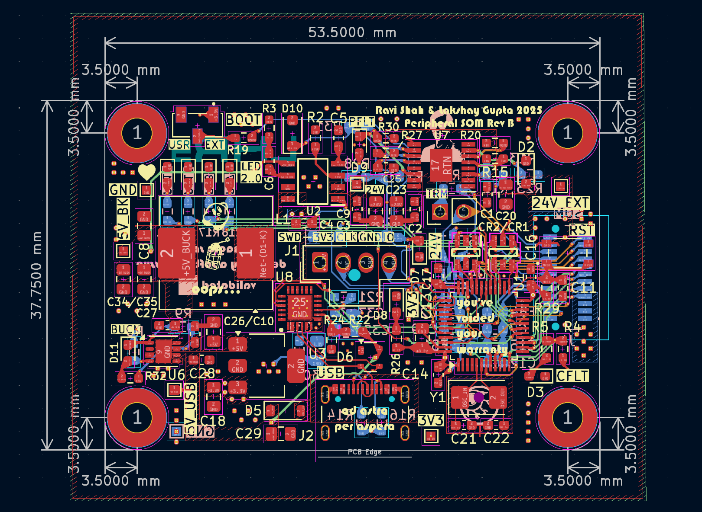

# PeripheralSOMPCB
The Peripheral System-On-Module handles communication with SPI or I2C based ICs, along with various analog inputs on peripheral boards to send data on the vehicle CAN bus.

## Daughter Board Pinout Usage Guide
Please refer to the [MCU pins sheet](https://utexas.sharepoint.com/:x:/r/sites/ENGR-LonghornRacing/_layouts/15/doc.aspx?sourcedoc=%7Bae949e00-1e0a-407f-a329-0fe6b0b1511b%7D&action=edit) to determine which pins can be used for each alternate function.

## BOM
[**BOM**](bom/PeripheralSOM.csv)  
[**IBOM**](bom/ibom.html)  

## PCB
)

## Schematic
[**PDF with all sheets**](docs/PeripheralSOM.pdf)

