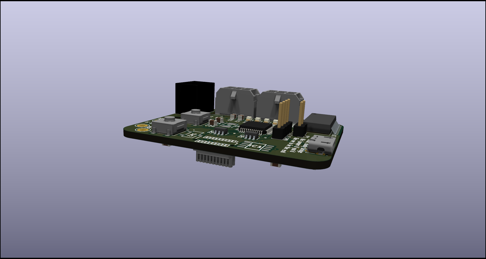

# BPS-PeripheralSOMPCB
The BPS Peripheral System on Module takes in the SPI or I2C of the various BPS boards (Volttemp and Amperes) and sends that along a can bus.

## Connectors
| # | Name | Type | Pin 1 | 2 | 3 | 4 | 5 | 6 | Purpose |
| - | - | - | - | - | - | - | - | - | - |
| J1  | SWD | 1x4xP2.54mm Female | +3.3V | SWCLK | SWDIO | GND | | | Flashing |
| J2  | CAN_In | 430450612 | Can Voltage | Can High | External 5V | Can GND | Can Low | Power GND | Input for CAN and Power |
| J3  | USB  | 105017-0001 | VBus | D+ | D- | ID | | | USB Debugging |
| J5  | CAN_Out | 430450612 | Can Voltage | Can High | External 5V | Can GND | Can Low | Power GND | Input for CAN and Power |
| J6  | | | | | | | | | Daughter Board Connector |

## Switches LEDs
| # | Purpose |
| - | - |
| D2  | 3.3V LED |
| D4  | Heartbeat LED |
| D12 | Extra LED |
| D13 | Extra LED |
| D14 | Extra LED |
| SW1 | Reset Switch |
| SW2 | Single Pole Double Throw Switch |
| SW5 | Push Button Switch |

## Testpoints
| # | Purpose |
| - | - |
| TP3 | 5V PWR |
| TP4 | GND PWR |
| TP5 | Isolated 5V |
| TP6 | Isolated GND |

## BOM
[**BOM**](BPS-PeripheralSOMBOM.xls)
[**IBOM**](ibom.html)

## PCB

## Schematic
[**PDF with all sheets**](BPS-PeripheralSOM_SCH.pdf)